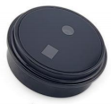
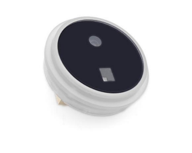
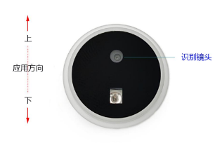
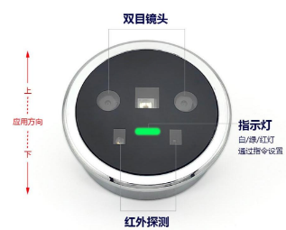

# DFRobot_Biometric
- [English Version](./README.md)

 FP001和FP002是人脸掌静脉识别模组，搭载仿生人脸识别算法，支持 UVC/UAC 方式传输，MJPEG 视
频格式，既实现了安全性，又兼具了良好的用户体验，具有功耗低、成本低、快速识别、外观
精致、产品结构小巧等特点，采用了高算力芯片，快速完成人脸识别和掌静脉识别的完整过程

Biometric库是对于这两个模块的功能进行统一的封装，SEN0736和SEN0737都具有人脸录入，人脸识别，用户查询，用户删除等功能。此外，SEN0737还具有三种颜色的指示灯，为其封装了三通不同颜色等的控制功能。算法在模块内完成，本库主要进行指令交互，下达命令，接受反馈，命令响应及时。


<table align="center">
  <tr>
    <td></td>
    <td></td>
    <td></td>
  </tr>
  <tr>
    <td></td>
    <td></td>
  </tr>
</table>


## 产品链接 (www.dfrobot.com)

    SKU：SEN0736 FP001和SEN0737FP002人脸与掌静脉识别模块

## 目录

  * [概述](#概述)
  * [库安装](#库安装)
  * [方法](#方法)
  * [兼容性](#兼容性)
  * [历史](#历史)
  * [创作者](#创作者)

## 概述

本库实现了人脸与掌静脉注册用户，用户识别，用户的删除管理，获取用户数量，控制指示灯等功能

## 库安装

使用此库前，请首先下载库文件，将其粘贴到\Arduino\libraries目录中，然后打开examples文件夹并在该文件夹中运行演示。

## 方法

```C++
  /**
   * @fn checkState
   * @brief 检查模块是否就绪且空闲
   * @return bool 类型
   * @retval true 模块就绪
   * @retval false 模块未就绪
   * @note 在初始化或执行命令前使用 checkState() 检查状态
   */
  bool checkState(void);

  /**
   * @fn enrollUser
   * @brief 录入人脸或掌静脉用于识别
   * @details 请确保传入的参数符合要求
   * @param kind eFaceUser 表示录入人脸，ePalmUser 表示录入掌静脉
   * @param userName 用户名，长度 1 到 32 个字符
   * @param id 存储录入后的用户 ID，范围 1 到 800
   * @param idAdmin 设置用户角色，eRoleAdmin 为管理员，eRoleNormal 为普通用户
   * @return 任务执行结果
   * @retval NO_ACK -1 没有收到模块的应答
   * @retval ERROR  -2 用户参数错误，如无效的用户类型或名称长度不符合要求
   * @retval 1 成功
   * @retval 2 重复
   * @retval 3 录入超时
   */
  int8_t enrollUser(eUserKind_t kind, const char* userName, uint16_t* id, eIsAdmin_t idAdmin);

  /**
   * @fn getAllNumsFaceUserIDs
   * @brief 获取人脸用户的数量
   * @return 人脸用户的数量
   * @retval NO_ACK -1 没有收到模块的应答
   */
  int16_t getAllNumsFaceUserIDs(void);

  /**
   * @fn getAllNumsPalmUserIDs
   * @brief 获取掌静脉用户的数量
   * @return 掌静脉用户的数量
   * @retval NO_ACK -1 没有收到模块的应答
   */
  int16_t getAllNumsPalmUserIDs(void);

  /**
   * @fn getAllFaceUserIDs
   * @brief 获取人脸用户的具体信息
   * @param id_buffer 存储人脸用户 ID 的数组
   * @param length id_buffer 的长度
   * @return 执行结果
   * @retval NO_ACK -1 没有收到模块的应答
   * @retval ERROR  -2 用户参数错误：传入的数组长度小于用户数量
   */
  int8_t getAllFaceUserIDs(uint16_t *id_buffer, uint16_t length);

  /**
   * @fn getRecognitionResult
   * @brief 对用户进行识别
   * @param ID 存储识别到的用户信息
   * @return 执行结果
   * @retval NO_ACK -1 没有收到模块的应答
   * @retval 1 成功
   * @retval 2 超时
   * @retval 3 用户未找到
   */
  int8_t getRecognitionResult(sId_t* ID);

  /**
   * @fn deleteUser
   * @brief 删除指定用户
   * @details ID 必须在有效范围内
   * @param id 用户 ID，范围 1 到 800
   * @return 删除结果
   * @retval NO_ACK -1 没有收到模块的应答
   * @retval ERROR  -2 ID 超出 1 到 800 的范围
   * @retval 1 删除成功
   * @retval 2 用户未找到
   * @retval 3 未知错误，建议重试
   */
  int8_t deleteUser(uint16_t id);

  /**
   * @fn deleteAllUser
   * @brief 删除所有用户
   * @return 删除结果
   * @retval NO_ACK -1 没有收到模块的应答
   * @retval 1 删除成功
   * @retval 2 未知错误，建议重试
   */
  int8_t deleteAllUser(void);

  /**
   * @fn ledColor
   * @brief 控制 LED 状态
   * @details 请确保传入的参数符合要求
   * @param color LED 颜色：COLOR_GREEN 绿色，COLOR_RED 红色，COLOR_WHITE 白色
   * @param kind LED_ON 开灯，LED_OFF 关灯
   * @return 执行结果
   * @retval NO_ACK -1 没有收到模块的应答
   * @retval ERROR -2 kind 或 color 参数无效
   * @retval 1 成功
   */
  int8_t ledColor(uint8_t color, uint8_t kind);
```

## 兼容性

| MCU                | 表现良好 | 表现异常 | 未测试 | 备注 |
| ------------------ | :------: | :------: | :-----: | ---- |
| Arduino Uno        |          |   √      |         |   不稳定            |
| Arduino Leonardo   |    √     |          |         |                     |
| Arduino MEGA2560   |    √     |          |         |                     |
| FireBeetle-ESP32   |    √     |          |         |                     |
| ESP8266            |    √     |          |         |                     |
| FireBeetle-M0      |    √     |          |         |                     |
| Micro:bit          |          |   √      |         |                     |


## 历史

- 2026/05/22 - 1.0.0 版本

## 创作者

Written by Olive-hy(feng.yang@dfrobot.com), 2026-4-30 (Welcome to our [website](https://www.dfrobot.com/))
